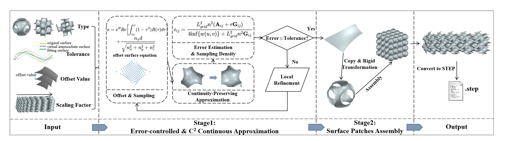

# TPMS2STEP

- By Yaonaiming Zhao and Qiang Zou (built on top of Charlie C. L. Wang's MeshWorks)
- Latest Release: 2024.06.21

This tool can translate Triply periodic minimal surface (TPMS) microstructure models to STEP files, the standard data exchange format of CAD/CAM/CAE. It also provides the following features: 
- Error-controlling: the tool can ensure that all translated STEP models are below a given error threshold;
- Continuity-preserving: the tool can preserve the C2 continuity among surfaces of a TPMS model after translation.



## !important
The source code was developed as a byproduct of the projects and methods presented in [1].

It can be compiled with GCC 11.4.0+CUDA 12.2, and run on the operating system Ubuntu 22.04 LTS. Windows, Mac, and other compilers should also work.


1.Copyright
-----------

- TPMS2STEP is GNU licensed. It is developed and maintained by Yaonaiming Zhao and Qiang Zou for research use. All rights about the program are reserved by Yaonaiming Zhao and Qiang Zou. This C++ source code is available only to a primary user for academic purposes. No secondary use, such as copy, distribution, diversion, business purpose, etc., is allowed. In no event shall the author be liable to any party for direct, indirect, special, incidental, or consequential damage arising out of the use of this program. TPMS2STEP is self-contained.


2.Download
----------

- The source code can be downloaded from: 
- [https://github.com/zpp323/TPMS2STEP](https://github.com/zpp323/TPMS2STEP)
- or
- [https://github.com/Qiang-Zou/TPMS2STEP](https://github.com/Qiang-Zou/TPMS2STEP)
  

3.Installing & Compiling (Ubuntu+QT 6.2.4+GCC 11.4.0)
-------------------------------------------

This project could be compiled by CMake (version>=3.18).

```shell
cd TPMS2STEP
mkdir build
cd build
cmake ../
make -j 4
```

4.Usage
-------

- After the compilation you can run the executable file TPMS2STEP inside the ./build directory.
- While running this software, you can choose the type of TPMS: 1 for Gyroid, 2 for Diamond, and 3 for SchwarzP.
- You can also change the number of TPMS units, the tolerance, and the offset values. The APIs are:

```c++
void setCellNumbers(int, int, int); // set the number of TPMS units for x,y,z directions
void setOffsetValue(float, float); // set the offset values
void setTolerance(float); // set the tolerance
```

5.File format
-------------

- The output files are <code>.STEP</code> format which can be directly utilized for further design, analysis, and manufacturing in modern CAD/CAE/CAM software packages like Simens NX and CATIA.

6.References
-------------

- [1] Yaonaiming Zhao, Qiang Zou, Guoyue Luo, Jiayu Wu, Sifan Chen, Depeng Gao, Minghao Xuan, Fuyu Wang, TPMS2STEP: error-controlled and C2 continuity-preserving translation of TPMS models to STEP files based on constrained-PIA, Computer-Aided Design (2024). https://doi.org/10.1016/j.cad.2024.103726
